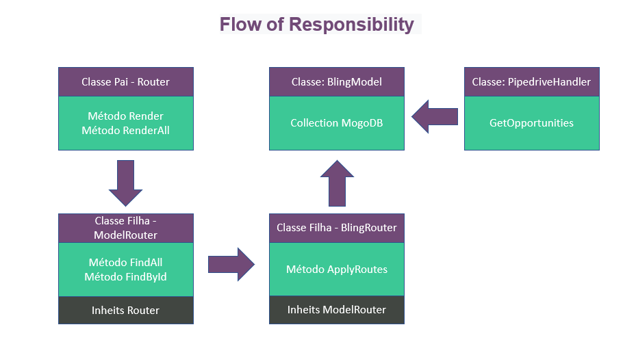

<p align="center">
  Integração entre Pipedrive e Pipeline utilizando Node e MongoDB
</p>
<p align="center">
  
</p>

### Tecnologias, Bibliotecas e Frameworks utilizadas(os)

* * **Nodejs** : Versão utilizada 12.6.4.
* * **Mongo DB** : Versão utilizada 4.6.
* * **Axios** : Versão utilizada 0.9.12.
* * **Mongoose** : Versão utilizada 5.9.12.
* * **restify** : Versão utilizada 8.5.1.

### Project Setup

#### Mudar Tokens e Chaves da do arquivo environment, presente em 'api/common/environment.js'

```
api_token_pipedrive: 'seu_token',
api_key_bling: 'sua key'

```


