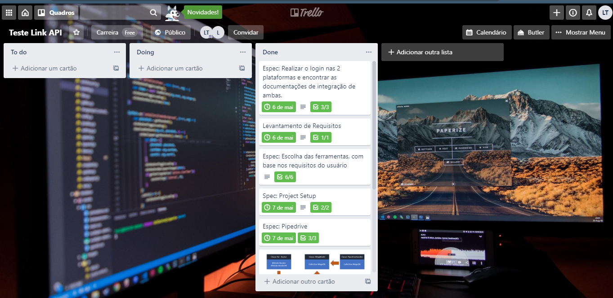

<p align="center">
  Integração entre Pipedrive e Bling utilizando Node e MongoDB
</p>
<p align="center">
  
</p>

### Trello: Para entender mais sobre o processo de desenvolvimento e acompanhar possíveis alterações, vite o link abaixo

* **Link** :  <a href="https://trello.com/b/H381ZC8f/teste-link-api" target="_blank">Clique Aqui</a>

<p align="center">
  
</p>

### Tecnologias, Bibliotecas e Frameworks utilizadas(os)

* * **Nodejs** : Versão utilizada 12.6.4.
* * **Mongo DB** : Versão utilizada 4.6.
* * **Axios** : Versão utilizada 0.9.12.
* * **Mongoose** : Versão utilizada 5.9.12.
* * **restify** : Versão utilizada 8.5.1.

### Project Setup

#### Mudar Tokens e Chaves da do arquivo environment, presente em 'api/common/environment.js'

```
api_token_pipedrive: 'seu_token',
api_key_bling: 'sua key'

```

#### Clonar ou baixar este repositório, navegue até a pasta com o seu prompt de preferência e rode npm install

```
npm install

```

#### npm start :) Para ver a API trabalhando na porta 4003

```
npm start

```
### Abra o navagador de sua prefertência e digite a uri abaixo. Caso de tudo certo, deverá retornar as informações do seu browser. Exemplo:

```
{
"browser": "Mozilla/5.0 (Windows NT 10.0; Win64; x64) AppleWebKit/537.36 (KHTML, like Gecko) Chrome/81.0.4044.129 Safari/537.36",
"method": "GET",
"url": "/",
"path": "/",
"query": {},
"timeout": 120000,
"DateRequest": "07/05/2020",
"HourRequest": "00:25:51",
"serverName": "Pipedrive and Bling integration",
"ipclient": "::1"
}

```
### Features

#### Retornar as oportunidades do pipedrive, cadastra-os na Collection no Mongo DB e insere como pedido no Bling 

```
GET: localhost:4003/opportunities

```
#### Retorna todos os Pedidos Cadastrados no Bling, conforme foram inseridos no Mongo DB

```
GET: localhost:4003/orderblings

```

#### Retorna 1 pedido com o id determinado no Request

```
GET: localhost:4003/orderbling/:id

```
### API Design

* A API foi desenvolvida utilizando o padrão Restful, com o auxílio do Framework Restify.
* Habilitação do CORS na API
* Mapeamento das Schemas dos Documentos com o Mongoose
* Tratamento de erros com o Restify

### Referências

* **Link da documentação específica dos pedidos da Bling** : <a href="https://manuais.bling.com.br/manual/?item=pedidos" target="_blank">Bling</a>
* **Link da documentação do Pipedrive** : <a href="https://manuais.bling.com.br/manual/?item=pedidos" target="_blank">Pipedrive</a>

### Code Review

* **Arquivo Main** : Script responsável por manipular o método bootstrap da Classe Server e orientar a manipulação de erros
ser houver falha. 
  O método bootstrap criado na Classe Server, recebe um array de Routers possibilitando a extensão da API
para outros recursos.

**main.js**
```
server.bootstrap([
  blingRouter.blingRouter,
  pipedriveRouter.pipedriveRouter,
]).then(server => {
    console.log('Server listening in port:', server.application.address())
}).catch(error => {
    console.log('Failed in initialize server')
    console.error(error)
    process.exit(1) //Uncaught Fatal Exception
})
```

* **Router** : Script que realiza o render das requisições, criando uma responsabilidade única, tornando o request e response
das requisições em um só padrão.

**common/router.js**
```
    envolope(document) {
        return document;
    }

    envelopeAll(documents, options = {}) {
        return documents
    }
 
    
    render(response, next) {
        return (document) => {
            if (document) {
                this.emit('beforeRender', document);
                response.json(this.envolope(document))
            }
            else {
                throw new restify_errors.NotFoundError('Document Not Found')
            }
            return next(false)
        }
    }

    renderAll(response, next, options = {}) {
        return (documents) => {
            if(documents) {
                documents.forEach((document, index, array) => {
                    this.emit('beforeRender', document)
                    array[index] = this.envolope(document)
                })
                response.json(this.envelopeAll(documents, options))
            }else{
                response.json(this.envelopeAll([]))
            }
            return next(false)
        }
    }
}

```

* **Model Router** :  A ideia do ModelRouer é enxugar um pouco a complexidade do Router e tirar um pouco da responsabilidade de lidar
     com os métodos que gerenciam requisições e respostas

**common/model.router.js**
```
 this.findAll = (req, resp, next) => {
            this.model.find()
                .then(this.render(resp, next))
                .catch(next)
        }

        this.findById = (req, resp, next) => {
            this.model.findById(req.params.id)
                .then(this.render(resp, next))
                .catch(next)
        }
```

